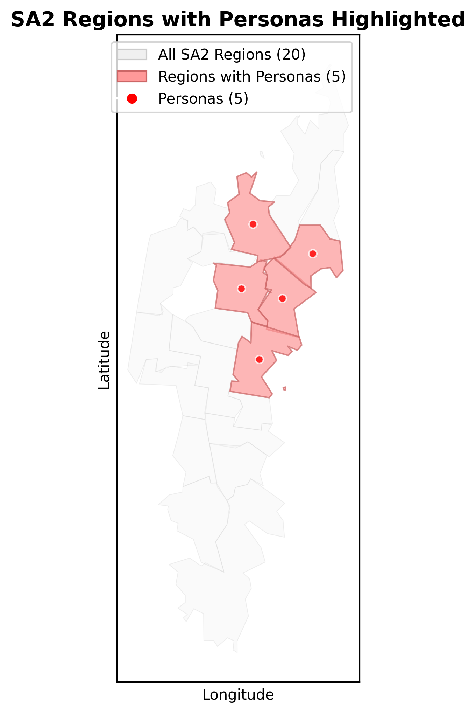
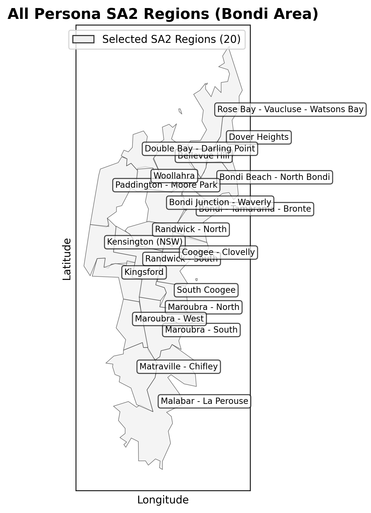

# Example Visualization Plots

This document shows example visualizations generated using the `geo_tools/plot_synthetic.py` module from the voxpop-crew repository. These plots demonstrate the visualization capabilities for analyzing and validating synthetic population data.

## 1. Multi-Region Comparison

**Function**: `plot_multi_region_comparison()`

This plot compares persona distributions across multiple regions side-by-side.



**Description**: The grid layout shows personas for different regions in separate subplots, color-coded by region. This enables comparison of synthetic population characteristics across regions and validation of consistency in the generation methodology.

## 2. Regions with Highlighted Personas

**Function**: `plot_regions_with_highlighted_personas()`

This plot shows all SA2 regions with highlighted regions that contain personas.



**Description**: The visualization displays all SA2 regions as a background map (light shading) with regions containing personas highlighted (darker shading). Persona points are overlaid on the map, providing a clear view of geographic coverage and distribution patterns.

## Technical Notes

- All plots use synthetic data only
- Geographic boundaries are from public ABS shapefiles
- Plots are generated using geopandas and matplotlib
- These examples demonstrate the visualization capabilities described in [visualization_overview.md](visualization_overview.md)

## Generating Your Own Plots

To generate similar plots, use the functions in `geo_tools/plot_synthetic.py` from the [voxpop-crew repository](https://github.com/blair-vox/voxpop-crew):

```python
from geo_tools.plot_synthetic import (
    plot_selected_regions,
    plot_personas_on_map,
    plot_multi_region_comparison,
    plot_regions_with_highlighted_personas
)

# Example: Plot selected regions
sa2_codes = ['115011290', '115011291', '115011292']
plot = plot_selected_regions(sa2_codes, title="Selected SA2 Regions")
plot.save('output.png')
```

For more details on usage and parameters, see [visualization_overview.md](visualization_overview.md).

