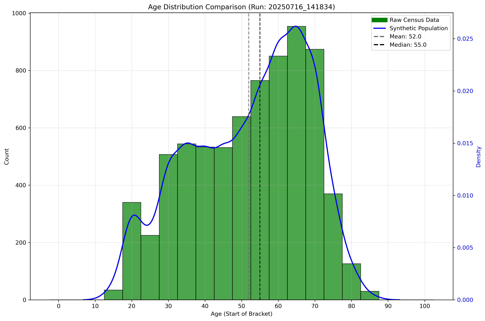
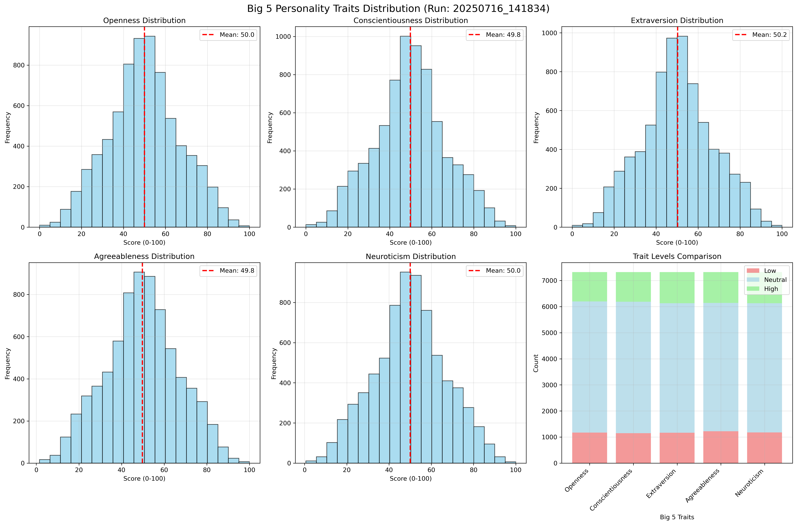
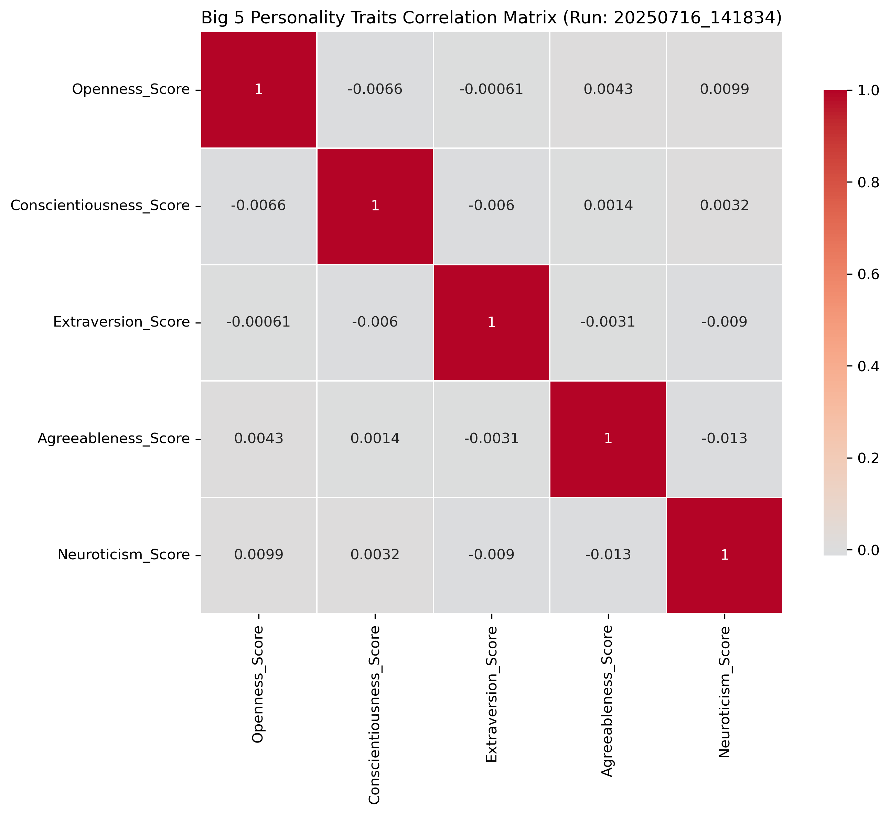
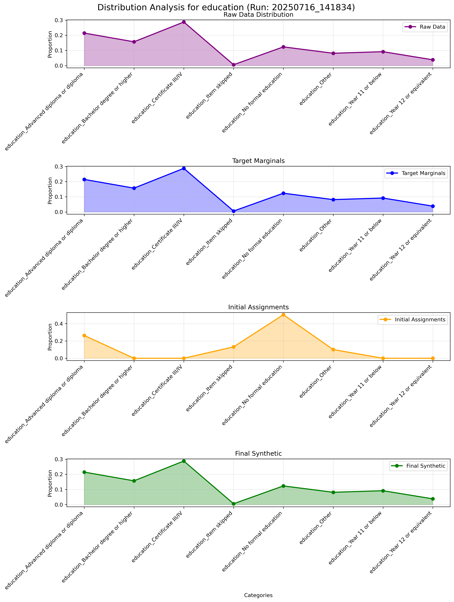
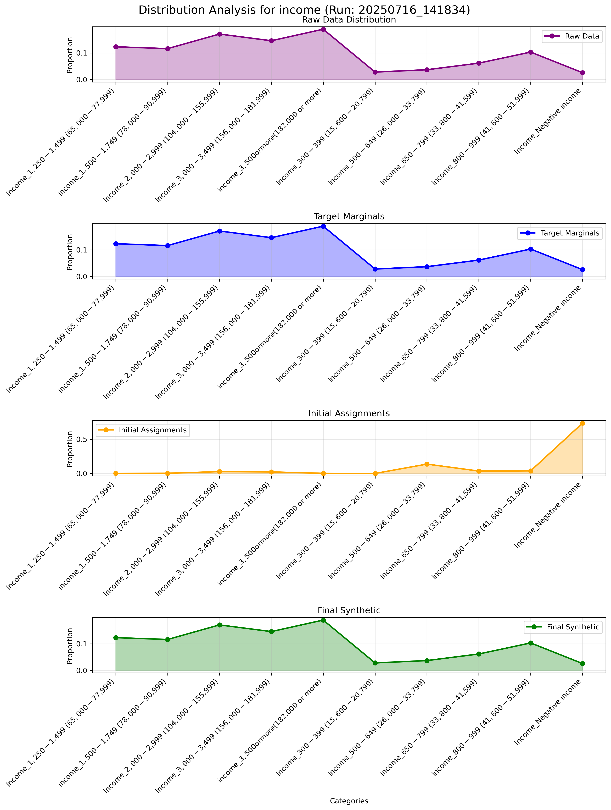
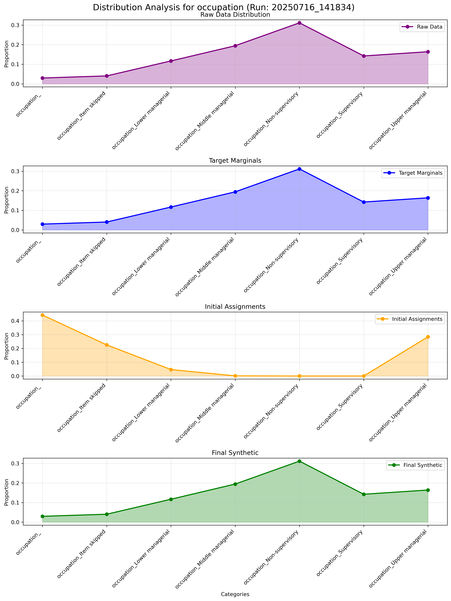

# SynC Pipeline Diagnostic Plots and Data

This document shows diagnostic plots and data from a SynC pipeline run (20250716_141834) demonstrating the synthetic population generation process. The plots validate that synthetic populations match census marginals and show the distribution characteristics of generated personas.

## Key Diagnostic Plots

### Age Distribution

**Description**: Distribution of ages in the synthetic population, showing how age groups are represented.

### Gender Distribution

**Description**: Gender distribution showing the proportion of male (M) and female (F) personas in the synthetic population.

### Big 5 Personality Traits

**Description**: Distribution of Big 5 personality traits (Openness, Conscientiousness, Extraversion, Agreeableness, Neuroticism) across the synthetic population.

### Big 5 Correlations

**Description**: Correlation matrix showing relationships between Big 5 personality traits.

## KDE Distribution Plots

### Education KDE Distribution

**Description**: Kernel Density Estimation (KDE) plot showing the probability distribution of education levels in the synthetic population.

### Income KDE Distribution

**Description**: KDE plot showing the probability distribution of income levels.

### Occupation KDE Distribution

**Description**: KDE plot showing the probability distribution of occupation categories.

## Synthetic Population Data Tables

*Note: The CSV files themselves are not included in this repository due to size constraints. The tables below show sample rows from the diagnostic output files.*

### Bellevue Hill Synthetic Population

**File**: `synthetic_population_Bellevue Hill.csv` (not included in repo)  
**Rows**: 7,320 personas  
**Description**: Individual-level synthetic personas for Bellevue Hill location with all attributes.

| Demographics | Age | Gender | Income | Housing Tenure | Job Tenure | Occupation | Education |
|---|---|---|---|---|---|---|---|
| PP_FM65_69 | 65.0 | F | $3,000-$3,499 | Own, paying off mortgage | Employee in private company | Non-supervisory | Advanced diploma or diploma |
| PP_M40_44 | 40.0 | M | $3,500 or more | Own, paying off mortgage | Self-employed | Middle managerial | Item skipped |
| PP_FM40_44 | 40.0 | F | $2,000-$2,999 | Own outright | Employee in private company | Upper managerial | Year 12 or equivalent |
| PP_M55_59 | 55.0 | M | $2,000-$2,999 | Own, paying off mortgage | Employee in private company | Middle managerial | Advanced diploma or diploma |
| PP_FM65_69 | 65.0 | F | $3,500 or more | Own, paying off mortgage | Employee in private company | Non-supervisory | Bachelor degree or higher |
| PP_M50_54 | 50.0 | M | $2,000-$2,999 | Own outright | Employee in private company | Supervisory | Certificate III/IV |
| PP_FM80_84 | 80.0 | F | $2,000-$2,999 | Own, paying off mortgage | Self-employed | Lower managerial | Bachelor degree or higher |
| PP_FM65_69 | 65.0 | F | $300-$399 | Own outright | Self-employed | Non-supervisory | Bachelor degree or higher |
| PP_FM55_59 | 55.0 | F | $3,500 or more | Own outright | (blank) | Supervisory | Advanced diploma or diploma |
| PP_FM50_54 | 50.0 | F | $2,000-$2,999 | Own outright | Employee in private company | Lower managerial | Bachelor degree or higher |

### All Locations Synthetic Population

**File**: `synthetic_population_ALL_LOCATIONS.csv` (not included in repo)  
**Rows**: 139,027 personas  
**Description**: Combined synthetic population across all processed locations.

| Location | Demographics | Age | Gender | Income | Housing Tenure | Job Tenure | Occupation |
|---|---|---|---|---|---|---|---|
| Bellevue Hill | PP_FM65_69 | 65.0 | F | $3,000-$3,499 | Own, paying off mortgage | Employee in private company | Non-supervisory |
| Bellevue Hill | PP_M40_44 | 40.0 | M | $3,500 or more | Own, paying off mortgage | Self-employed | Middle managerial |
| Bellevue Hill | PP_FM40_44 | 40.0 | F | $2,000-$2,999 | Own outright | Employee in private company | Upper managerial |
| Bellevue Hill | PP_M55_59 | 55.0 | M | $2,000-$2,999 | Own, paying off mortgage | Employee in private company | Middle managerial |
| Bellevue Hill | PP_FM65_69 | 65.0 | F | $3,500 or more | Own, paying off mortgage | Employee in private company | Non-supervisory |
| Bellevue Hill | PP_M50_54 | 50.0 | M | $2,000-$2,999 | Own outright | Employee in private company | Supervisory |
| Bellevue Hill | PP_FM80_84 | 80.0 | F | $2,000-$2,999 | Own, paying off mortgage | Self-employed | Lower managerial |
| Bellevue Hill | PP_FM65_69 | 65.0 | F | $300-$399 | Own outright | Self-employed | Non-supervisory |
| Bellevue Hill | PP_FM55_59 | 55.0 | F | $3,500 or more | Own outright | (blank) | Supervisory |
| Bellevue Hill | PP_FM50_54 | 50.0 | F | $2,000-$2,999 | Own outright | Employee in private company | Lower managerial |

### Synthetic Probabilities DataFrame

**File**: `synthetic_df.csv` (not included in repo)  
**Description**: Probability distributions for engagement features (example: Contributed_money frequencies).

| engagement_Contributed_money_Frequently | engagement_Contributed_money_Not_at_all | engagement_Contributed_money_Rarely | engagement_Contributed_money_Occasionally |
|---|---|---|---|
| 0.18196914 | 0.28758383 | 0.29676324 | 0.23368374 |
| 0.15786368 | 0.27714503 | 0.31555626 | 0.24943493 |
| 0.15786368 | 0.27714503 | 0.31555626 | 0.24943493 |
| 0.15786368 | 0.27714503 | 0.31555626 | 0.24943493 |
| 0.15786368 | 0.27714503 | 0.31555626 | 0.24943493 |
| 0.18196914 | 0.28758383 | 0.29676324 | 0.23368374 |
| 0.15786368 | 0.27714503 | 0.31555626 | 0.24943493 |
| 0.18196914 | 0.28758383 | 0.29676324 | 0.23368374 |
| 0.18196914 | 0.28758383 | 0.29676324 | 0.23368374 |
| 0.18196914 | 0.28758383 | 0.29676324 | 0.23368374 |

### Synthetic Results DataFrame

**File**: `synthetic_results_df.csv` (not included in repo)  
**Rows**: 457 rows  
**Description**: Feature predictions from neural network models showing predicted probabilities for income, housing, occupation, education, and other attributes. Values are normalized probability scores from neural network outputs.

| Row | Income (sample) | Housing Tenure (sample) | Job Tenure (sample) | Occupation (sample) |
|---|---|---|---|---|
| 0 | 0.020537 | -0.038295 | -0.038295 | -0.038295 |
| 1 | -0.038295 | -0.038295 | -0.038295 | -0.038295 |
| 2 | -0.038295 | -0.038295 | -0.038295 | -0.038295 |
| 3 | -0.038295 | -0.038295 | -0.038295 | -0.038295 |
| 4 | -0.038295 | -0.038295 | -0.038295 | -0.038295 |
| 5 | 0.181969 | 0.287584 | 0.296763 | 0.233684 |
| 6 | -0.038295 | -0.038295 | -0.038295 | -0.038295 |
| 7 | 0.181969 | 0.287584 | 0.296763 | 0.233684 |
| 8 | 0.181969 | 0.287584 | 0.296763 | 0.233684 |
| 9 | 0.181969 | 0.287584 | 0.296763 | 0.233684 |

*Note: This file contains normalized probability values from neural network predictions across 36 feature categories. Values shown are a subset of key features.*

## Marginal Matching Plots

Marginal plots show how synthetic assignments match target census marginals. Each plot compares initial neural network predictions with final assignments after marginal matching.

| Feature | Plot |
|---|---|
| Basket Size | [marginals/basketsize_marginal_plot_20250716_141834.png](sync_diagnostic_plots/marginals/basketsize_marginal_plot_20250716_141834.png) |
| Category Spend Bias | [marginals/categoryspendbias_marginal_plot_20250716_141834.png](sync_diagnostic_plots/marginals/categoryspendbias_marginal_plot_20250716_141834.png) |
| Education | [marginals/education_marginal_plot_20250716_141834.png](sync_diagnostic_plots/marginals/education_marginal_plot_20250716_141834.png) |
| Household Size | [marginals/household_size_marginal_plot_20250716_141834.png](sync_diagnostic_plots/marginals/household_size_marginal_plot_20250716_141834.png) |
| Housing Tenure | [marginals/housing_tenure_marginal_plot_20250716_141834.png](sync_diagnostic_plots/marginals/housing_tenure_marginal_plot_20250716_141834.png) |
| Income | [marginals/income_marginal_plot_20250716_141834.png](sync_diagnostic_plots/marginals/income_marginal_plot_20250716_141834.png) |
| Job Tenure | [marginals/job_tenure_marginal_plot_20250716_141834.png](sync_diagnostic_plots/marginals/job_tenure_marginal_plot_20250716_141834.png) |
| Marital Status | [marginals/marital_status_marginal_plot_20250716_141834.png](sync_diagnostic_plots/marginals/marital_status_marginal_plot_20250716_141834.png) |
| Occupation | [marginals/occupation_marginal_plot_20250716_141834.png](sync_diagnostic_plots/marginals/occupation_marginal_plot_20250716_141834.png) |
| Preferred Channel | [marginals/preferredchannel_marginal_plot_20250716_141834.png](sync_diagnostic_plots/marginals/preferredchannel_marginal_plot_20250716_141834.png) |
| Price Sensitivity | [marginals/pricesensitivity_marginal_plot_20250716_141834.png](sync_diagnostic_plots/marginals/pricesensitivity_marginal_plot_20250716_141834.png) |
| Private Label Preference | [marginals/privatelabelpreference_marginal_plot_20250716_141834.png](sync_diagnostic_plots/marginals/privatelabelpreference_marginal_plot_20250716_141834.png) |
| Shopping Frequency | [marginals/shoppingfrequency_marginal_plot_20250716_141834.png](sync_diagnostic_plots/marginals/shoppingfrequency_marginal_plot_20250716_141834.png) |
| Engagement: Attended Political Meetings | [marginals/engagement_attended_political_meetings_marginal_plot_20250716_141834.png](sync_diagnostic_plots/marginals/engagement_attended_political_meetings_marginal_plot_20250716_141834.png) |
| Engagement: Attention to Internet | [marginals/engagement_attention_to_internet_marginal_plot_20250716_141834.png](sync_diagnostic_plots/marginals/engagement_attention_to_internet_marginal_plot_20250716_141834.png) |
| Engagement: Attention to Newspapers | [marginals/engagement_attention_to_newspapers_marginal_plot_20250716_141834.png](sync_diagnostic_plots/marginals/engagement_attention_to_newspapers_marginal_plot_20250716_141834.png) |
| Engagement: Attention to Radio | [marginals/engagement_attention_to_radio_marginal_plot_20250716_141834.png](sync_diagnostic_plots/marginals/engagement_attention_to_radio_marginal_plot_20250716_141834.png) |
| Engagement: Attention to Television | [marginals/engagement_attention_to_television_marginal_plot_20250716_141834.png](sync_diagnostic_plots/marginals/engagement_attention_to_television_marginal_plot_20250716_141834.png) |
| Engagement: Contributed Money | [marginals/engagement_contributed_money_marginal_plot_20250716_141834.png](sync_diagnostic_plots/marginals/engagement_contributed_money_marginal_plot_20250716_141834.png) |
| Engagement: Discussed Politics In Person | [marginals/engagement_discussed_politics_in_person_marginal_plot_20250716_141834.png](sync_diagnostic_plots/marginals/engagement_discussed_politics_in_person_marginal_plot_20250716_141834.png) |
| Engagement: Discussed Politics Online | [marginals/engagement_discussed_politics_online_marginal_plot_20250716_141834.png](sync_diagnostic_plots/marginals/engagement_discussed_politics_online_marginal_plot_20250716_141834.png) |
| Engagement: Interest in Politics | [marginals/engagement_interest_in_politics_marginal_plot_20250716_141834.png](sync_diagnostic_plots/marginals/engagement_interest_in_politics_marginal_plot_20250716_141834.png) |
| Engagement: Persuaded Others to Vote | [marginals/engagement_persuaded_others_to_vote_marginal_plot_20250716_141834.png](sync_diagnostic_plots/marginals/engagement_persuaded_others_to_vote_marginal_plot_20250716_141834.png) |
| Engagement: Showed Support for a Party | [marginals/engagement_showed_support_for_a_party_marginal_plot_20250716_141834.png](sync_diagnostic_plots/marginals/engagement_showed_support_for_a_party_marginal_plot_20250716_141834.png) |
| Issues: Education | [marginals/issues_education_marginal_plot_20250716_141834.png](sync_diagnostic_plots/marginals/issues_education_marginal_plot_20250716_141834.png) |
| Issues: Global Warming | [marginals/issues_global_warming_marginal_plot_20250716_141834.png](sync_diagnostic_plots/marginals/issues_global_warming_marginal_plot_20250716_141834.png) |
| Issues: Health and Medicare | [marginals/issues_health_and_medicare_marginal_plot_20250716_141834.png](sync_diagnostic_plots/marginals/issues_health_and_medicare_marginal_plot_20250716_141834.png) |
| Issues: Immigration | [marginals/issues_immigration_marginal_plot_20250716_141834.png](sync_diagnostic_plots/marginals/issues_immigration_marginal_plot_20250716_141834.png) |
| Issues: Management of the Economy | [marginals/issues_management_of_the_economy_marginal_plot_20250716_141834.png](sync_diagnostic_plots/marginals/issues_management_of_the_economy_marginal_plot_20250716_141834.png) |
| Issues: National Security | [marginals/issues_national_security_marginal_plot_20250716_141834.png](sync_diagnostic_plots/marginals/issues_national_security_marginal_plot_20250716_141834.png) |
| Issues: Refugees and Asylum Seekers | [marginals/issues_refugees_and_asylum_seekers_marginal_plot_20250716_141834.png](sync_diagnostic_plots/marginals/issues_refugees_and_asylum_seekers_marginal_plot_20250716_141834.png) |
| Issues: Taxation | [marginals/issues_taxation_marginal_plot_20250716_141834.png](sync_diagnostic_plots/marginals/issues_taxation_marginal_plot_20250716_141834.png) |
| Issues: The Cost of Living | [marginals/issues_the_cost_of_living_marginal_plot_20250716_141834.png](sync_diagnostic_plots/marginals/issues_the_cost_of_living_marginal_plot_20250716_141834.png) |
| Issues: The COVID-19 Pandemic | [marginals/issues_the_covid-19_pandemic_marginal_plot_20250716_141834.png](sync_diagnostic_plots/marginals/issues_the_covid-19_pandemic_marginal_plot_20250716_141834.png) |
| Issues: The Environment | [marginals/issues_the_environment_marginal_plot_20250716_141834.png](sync_diagnostic_plots/marginals/issues_the_environment_marginal_plot_20250716_141834.png) |

## KDE Distribution Plots

Kernel Density Estimation (KDE) plots show the probability distributions of features, helping validate that synthetic data maintains realistic statistical properties.

| Feature | Plot |
|---|---|
| Basket Size | [kde/basketsize_kde_distributions_20250716_141834.png](sync_diagnostic_plots/kde/basketsize_kde_distributions_20250716_141834.png) |
| Category Spend Bias | [kde/categoryspendbias_kde_distributions_20250716_141834.png](sync_diagnostic_plots/kde/categoryspendbias_kde_distributions_20250716_141834.png) |
| Household Size | [kde/household_size_kde_distributions_20250716_141834.png](sync_diagnostic_plots/kde/household_size_kde_distributions_20250716_141834.png) |
| Housing Tenure | [kde/housing_tenure_kde_distributions_20250716_141834.png](sync_diagnostic_plots/kde/housing_tenure_kde_distributions_20250716_141834.png) |
| Job Tenure | [kde/job_tenure_kde_distributions_20250716_141834.png](sync_diagnostic_plots/kde/job_tenure_kde_distributions_20250716_141834.png) |
| Marital Status | [kde/marital_status_kde_distributions_20250716_141834.png](sync_diagnostic_plots/kde/marital_status_kde_distributions_20250716_141834.png) |
| Preferred Channel | [kde/preferredchannel_kde_distributions_20250716_141834.png](sync_diagnostic_plots/kde/preferredchannel_kde_distributions_20250716_141834.png) |
| Price Sensitivity | [kde/pricesensitivity_kde_distributions_20250716_141834.png](sync_diagnostic_plots/kde/pricesensitivity_kde_distributions_20250716_141834.png) |
| Private Label Preference | [kde/privatelabelpreference_kde_distributions_20250716_141834.png](sync_diagnostic_plots/kde/privatelabelpreference_kde_distributions_20250716_141834.png) |
| Shopping Frequency | [kde/shoppingfrequency_kde_distributions_20250716_141834.png](sync_diagnostic_plots/kde/shoppingfrequency_kde_distributions_20250716_141834.png) |
| Engagement: Attended Political Meetings | [kde/engagement_attended_political_meetings_kde_distributions_20250716_141834.png](sync_diagnostic_plots/kde/engagement_attended_political_meetings_kde_distributions_20250716_141834.png) |
| Engagement: Attention to Internet | [kde/engagement_attention_to_internet_kde_distributions_20250716_141834.png](sync_diagnostic_plots/kde/engagement_attention_to_internet_kde_distributions_20250716_141834.png) |
| Engagement: Attention to Newspapers | [kde/engagement_attention_to_newspapers_kde_distributions_20250716_141834.png](sync_diagnostic_plots/kde/engagement_attention_to_newspapers_kde_distributions_20250716_141834.png) |
| Engagement: Attention to Radio | [kde/engagement_attention_to_radio_kde_distributions_20250716_141834.png](sync_diagnostic_plots/kde/engagement_attention_to_radio_kde_distributions_20250716_141834.png) |
| Engagement: Attention to Television | [kde/engagement_attention_to_television_kde_distributions_20250716_141834.png](sync_diagnostic_plots/kde/engagement_attention_to_television_kde_distributions_20250716_141834.png) |
| Engagement: Contributed Money | [kde/engagement_contributed_money_kde_distributions_20250716_141834.png](sync_diagnostic_plots/kde/engagement_contributed_money_kde_distributions_20250716_141834.png) |
| Engagement: Discussed Politics In Person | [kde/engagement_discussed_politics_in_person_kde_distributions_20250716_141834.png](sync_diagnostic_plots/kde/engagement_discussed_politics_in_person_kde_distributions_20250716_141834.png) |
| Engagement: Discussed Politics Online | [kde/engagement_discussed_politics_online_kde_distributions_20250716_141834.png](sync_diagnostic_plots/kde/engagement_discussed_politics_online_kde_distributions_20250716_141834.png) |
| Engagement: Interest in Politics | [kde/engagement_interest_in_politics_kde_distributions_20250716_141834.png](sync_diagnostic_plots/kde/engagement_interest_in_politics_kde_distributions_20250716_141834.png) |
| Engagement: Persuaded Others to Vote | [kde/engagement_persuaded_others_to_vote_kde_distributions_20250716_141834.png](sync_diagnostic_plots/kde/engagement_persuaded_others_to_vote_kde_distributions_20250716_141834.png) |
| Engagement: Showed Support for a Party | [kde/engagement_showed_support_for_a_party_kde_distributions_20250716_141834.png](sync_diagnostic_plots/kde/engagement_showed_support_for_a_party_kde_distributions_20250716_141834.png) |
| Issues: Education | [kde/issues_education_kde_distributions_20250716_141834.png](sync_diagnostic_plots/kde/issues_education_kde_distributions_20250716_141834.png) |
| Issues: Global Warming | [kde/issues_global_warming_kde_distributions_20250716_141834.png](sync_diagnostic_plots/kde/issues_global_warming_kde_distributions_20250716_141834.png) |
| Issues: Health and Medicare | [kde/issues_health_and_medicare_kde_distributions_20250716_141834.png](sync_diagnostic_plots/kde/issues_health_and_medicare_kde_distributions_20250716_141834.png) |
| Issues: Immigration | [kde/issues_immigration_kde_distributions_20250716_141834.png](sync_diagnostic_plots/kde/issues_immigration_kde_distributions_20250716_141834.png) |
| Issues: Management of the Economy | [kde/issues_management_of_the_economy_kde_distributions_20250716_141834.png](sync_diagnostic_plots/kde/issues_management_of_the_economy_kde_distributions_20250716_141834.png) |
| Issues: National Security | [kde/issues_national_security_kde_distributions_20250716_141834.png](sync_diagnostic_plots/kde/issues_national_security_kde_distributions_20250716_141834.png) |
| Issues: Refugees and Asylum Seekers | [kde/issues_refugees_and_asylum_seekers_kde_distributions_20250716_141834.png](sync_diagnostic_plots/kde/issues_refugees_and_asylum_seekers_kde_distributions_20250716_141834.png) |
| Issues: Taxation | [kde/issues_taxation_kde_distributions_20250716_141834.png](sync_diagnostic_plots/kde/issues_taxation_kde_distributions_20250716_141834.png) |
| Issues: The Cost of Living | [kde/issues_the_cost_of_living_kde_distributions_20250716_141834.png](sync_diagnostic_plots/kde/issues_the_cost_of_living_kde_distributions_20250716_141834.png) |
| Issues: The COVID-19 Pandemic | [kde/issues_the_covid-19_pandemic_kde_distributions_20250716_141834.png](sync_diagnostic_plots/kde/issues_the_covid-19_pandemic_kde_distributions_20250716_141834.png) |
| Issues: The Environment | [kde/issues_the_environment_kde_distributions_20250716_141834.png](sync_diagnostic_plots/kde/issues_the_environment_kde_distributions_20250716_141834.png) |

## Understanding the Diagnostic Plots

### Marginal Matching Plots

These plots show the marginal matching process (Phase 3 of SynC pipeline):
- **Target Marginals**: Census totals (blue bars)
- **Initial Assignments**: Neural network predictions before matching (orange bars)
- **Final Synthetic**: After marginal matching algorithm (green bars)

The plots validate that the iterative marginal matching algorithm successfully adjusts synthetic assignments to exactly match census totals.

### KDE Distribution Plots

KDE plots show the probability density functions of features:
- Help validate that synthetic distributions are realistic
- Show the shape and spread of feature distributions
- Enable comparison with expected statistical properties

### Age and Gender Distributions

These fundamental demographic plots validate:
- Age distribution matches census age structure
- Gender balance is appropriate
- No unrealistic clustering or gaps

### Big 5 Personality Traits

The personality plots show:
- Distribution of each trait (Openness, Conscientiousness, Extraversion, Agreeableness, Neuroticism)
- Correlation structure between traits
- Validation that personality assignments are realistic and varied

---

**Run Information**: This diagnostic data is from SynC pipeline run `20250716_141834` processing Bellevue Hill location. All data is synthetically generated from public census data.

